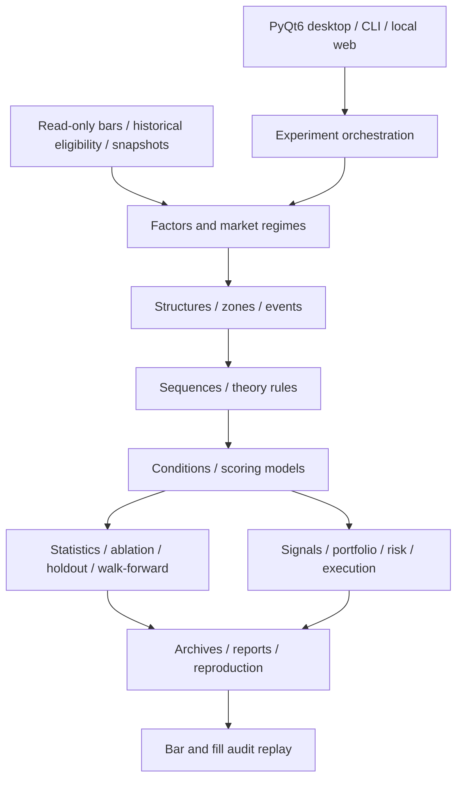

# Niuniu · Unified Technical Factor Research Platform

[简体中文](README.md) | **English**

<p align="center"></p>

**Turn trading theories into computable, testable, and replayable research workflows.**

Niuniu is a local Python platform for equity technical analysis and quantitative research, with a **native PyQt6 desktop client, a CLI research engine, and a local web workbench**. It connects market data, historical universes, market regimes, structures, events, sequences, rule scores, and independent execution backtests through a shared experiment and archive system.

The platform helps answer practical questions: When was a pattern actually confirmed? Under which market conditions did it work? Does a combination improve on its individual inputs? What happens after trading costs and execution constraints?

The current version is `0.1.0` and remains under development. Research defaults to **forward-adjusted prices (`qfq`)**. The current delivery focuses on explicit rules and offline validation; machine-learning training and live trading are outside its scope.

[Quick start](#quick-start) · [Features](#core-features) · [Workflow](#typical-research-workflow) · [Data requirements](#data-requirements-and-calculation-conventions) · [Limitations](#current-limitations)

## What this repository is for

Technical analysis often conflates recognizing a pattern, generating a signal, and being able to trade it. Niuniu treats these as separate stages:

- **Shared research objects:** different theories reuse factors, events, zones, structures, and sequences instead of requiring separate backtest systems.
- **Explicit information timing:** occurrence time and `available_at` are distinct. Confirmed structures and higher-timeframe information are used only when available, with prefix-consistency checks and replay audits.
- **Comparable hypotheses:** retain regime definitions, fixed parameters, ablation, holdout, and walk-forward results instead of displaying only the best parameter set.
- **Separate prediction and execution:** forward-return labels and IC are research statistics. Orders, rejections, holdings, and equity are calculated by an independent execution module.
- **Traceable experiments:** record configuration, versions, source and data fingerprints, and experiment-specific observations, reports, dependencies, and reproduction inputs.

The project is intended for individual quantitative researchers, developers formalizing technical-analysis rules, and teams reviewing causality and reproducibility. Existing local market data can be connected through adapters. Full-market datasets and historical experiment return series are not included in this repository.

## Core features

| Module | Available capabilities |
|---|---|
| Native desktop | Data center, factor library, market regimes, structures/events, sequence builder, theory lab, experiment center, combinations/models, strategy backtesting, and result comparison; business forms, parameters, task state, and reports |
| Data and universes | Read-only MQC Parquet access, raw/qfq prices, data quality audits, fixed data versions, historical listing intervals, point-in-time eligibility interfaces, and Baostock reference-data archives |
| Factor registry | Versioned FactorPacks, default parameters and dependency tracking; expression and custom computation paths; content caching and selected incremental computations |
| Regimes and timeframes | Rule-based trend/range, direction, and volatility states; daily context filters; availability-based alignment; complete-session 15m/30m/60m bars resampled from 5m |
| Structures, events, sequences | Confirmed pivots, breakouts and failures, FVG, BOS, OB, and other explicit rules; ordered steps, repetition, timeout, invalidation, nesting, and event-chain deduplication |
| Rule combinations and scores | Boolean conditions, linear scores, preprocessing, cross-sectional ranking and standardization; training-window preprocessing and residual projections |
| Research experiments | Single factors, ablation, parameter grids, fixed train/validation/test splits, walk-forward studies, component-to-combination theory plans, correlation, and redundancy comparisons |
| Research statistics | IC/Rank IC, quantile returns, MFE/MAE, date-block bootstrap, permutation and Holm correction, paired increments, subsample equivalence, and Shanghai/Shenzhen group validation |
| Independent execution | Next-bar-open simulation, cash and positions, lot sizes, T+1, costs and slippage, trading constraints, target-versus-actual holdings, fills/rejections, and equity |
| Audit and reproduction | Replay by date, signal, event, or fill; structure layers and actual-timeframe switching; configuration and artifact archives, export/restore, and numerical reproduction for supported experiment types |
| Tasks and continuation | Persisted local task state; classic Chan checkpoints, appended-bar continuation, and interruption recovery. Universal continuation is not implemented for every algorithm |
| AI research assistant | Structured research memory, fixed campaigns, restricted-DSL candidates, Research Agenda, Safe Alpha Factory, persistent monitoring, standard MCP, and controlled background scheduling; models cannot approve studies or auto-promote candidates to the watchlist |

The desktop also has a **boss key, F12**. On macOS, it hides the application and its dialogs; the Dock icon restores it. Background computation and unsaved form values are retained. Some keyboards require `Fn + F12`. Other window systems use minimization; native interaction testing has primarily been performed on macOS.

### Theory and factor families

| Family | Implementation scope |
|---|---|
| Basic technical factors | Momentum, ATR, return volatility, signed directional efficiency, price-range measures, and other explicit technical rules |
| Classic Chan theory | Bar inclusion, fractals, strokes, segments, centers, divergence, and buy/sell-point factors; event sequences, scoring, state continuation, and confirmed-segment nesting across actual timeframes |
| Wyckoff | Events, A–E phases, sequences, and research workflows based on explicit price/volume rules, with thresholds, confirmation, and invalidation |
| Brooks | Trend context, pullbacks, second entries, breakout pullbacks, measured targets, and three-extreme contraction/reversal components |
| ICT / SMC | Price-action components and sequences involving sweeps, displacement, MSS, BOS, FVG, and order blocks |
| Alpha101 / Alpha158 | Frozen upstream vn.py expressions: **82 Alpha101 formulas** and **158 Alpha158 features**. This is not a complete 101-formula implementation or an assertion of paper-exact replication |

Registration counts are not completion percentages. Run `quantlab factors` and `quantlab theories` to inspect the current entries, parameters, and mappings. Subjective judgments in Brooks, ICT, SMC, and Wyckoff must be expressed as explicit rules; the platform does not claim to implement every interpretation of those theories.

Computing Alpha formulas requires the optional `vnpy` dependencies. Listing the registry or running basic factors does not require a trading backend.

## Architecture



The research core is separate from the GUI, concrete data sources, and execution adapters. `src/quantlab/app.py` assembles the default registry and runner; `experiments/` orchestrates studies; `execution/` calculates trading accounts; and `storage/` persists traceable outputs. vn.py is an optional offline adapter, not the desktop UI framework.

## Quick start

### 1. Requirements and installation

Python **3.11+** is required. The core dependencies are Polars, PyArrow, and DuckDB. The native desktop additionally requires PyQt6. Development and most native client validation currently take place on macOS; window behavior and optional dependency compatibility need separate validation on other platforms.

```bash
git clone https://github.com/anyuzhe/niuniu.git
cd niuniu
python3 -m venv .venv
source .venv/bin/activate
python -m pip install -e ".[desktop]"
```

On Windows PowerShell, activate the environment with `.venv\Scripts\Activate.ps1`. For CLI-only usage, install with `python -m pip install -e .`.

Install optional data retrieval or vn.py functionality as needed:

```bash
python -m pip install -e ".[market_data]"
python -m pip install -e ".[vnpy]"
python -m pip install -e ".[mcp]"
```

See [pyproject.toml](pyproject.toml) for dependency constraints. These commands do not install a broker gateway or connect a live trading account.

### 2. Explore without market data

```bash
quantlab factors
quantlab theories
quantlab desktop --output ./artifacts
```

Without a data root, you can browse the interface and registry. Market-data experiments require a valid source.

### Standard MCP and persistent tracking

After installing `.[mcp]`, local agents can connect over stdio with `niuniu-mcp --output ./artifacts --data-root /path/to/data`. For HTTP use `--transport streamable-http --host 127.0.0.1 --port 8766`. Non-loopback binds are rejected; use an SSH tunnel or an authenticated reverse proxy across machines. MCP exposes only the existing model-safe tools and does not add download, approval, execution, DSL-registration, or tracking-authorization privileges.

When the desktop is closed, run `niuniu-tracking-daemon --output ./artifacts --data-root /path/to/data`. It consumes only tracking grants already saved by the host and preserves the original single-worker `JobQueue` boundary. `quantlab tracking-launchd-write ...` can generate a macOS LaunchAgent plist but does not load it or create an authorization.

### 3. Connect local market data

Replace `/path/to/MQC-DATA` with your actual MQC data root:

```bash
quantlab desktop --data-root /path/to/MQC-DATA --output ./artifacts
```

The equivalent desktop entry point is:

```bash
python -m quantlab.desktop --data-root /path/to/MQC-DATA --output ./artifacts
```

The macOS `.command` launcher in the repository uses the original development-machine path, `/Volumes/Lexar/MQC-DATA`. On another machine, use the explicit commands above or adjust that path.

### 4. Run a basic study

The following command requires bars for the specified stocks and date range. Adapt the symbols, dates, and warmup length to your dataset.

```bash
quantlab run \
  --data-root /path/to/MQC-DATA --output ./artifacts \
  --symbols sh.600000 sz.000001 sh.600519 \
  --timeframe 1d --start 2024-01-01 --end 2024-12-31 \
  --factor BASE.MOMENTUM --lookback 20 \
  --horizons 1 5 20 --adjustment qfq --replay
```

Inspect the command output and reports under `artifacts/`. Small samples are useful for checking the workflow, not for establishing strategy effectiveness.

### 5. Backtest a rule score

[examples/score.json](examples/score.json) defines a linear score from momentum and directional efficiency:

```bash
quantlab run \
  --data-root /path/to/MQC-DATA --output ./artifacts \
  --symbols sh.600000 sz.000001 sh.600519 \
  --timeframe 1d --start 2024-01-01 --end 2024-12-31 \
  --factor COMB.SCORE --params-json examples/score.json \
  --adjustment qfq --backtest --execution-backend open --replay
```

Use `quantlab run --help` for advanced options, or configure the study with the desktop business forms and export its JSON. To use the optional local web workbench, run `quantlab serve --data-root /path/to/MQC-DATA --output ./artifacts`; see `quantlab serve --help` for binding and port options.

## Typical research workflow

1. **Data center:** select stocks, dates, timeframe, and price adjustment. Check missing data, historical listing eligibility, and trading-rule coverage.
2. **Regimes and structures:** define trend/range context, choose confirmed structures or events, and specify occurrence, confirmation, and invalidation rules.
3. **Sequences and models:** connect events into ordered sequences and construct conditions or scores. “Model” here means a rule model.
4. **Research validation:** compare components with the full combination, then run ablation, holdout, walk-forward, and multiple-testing procedures. Retain all trials, not just winners.
5. **Execution backtest:** configure portfolio rules, costs, slippage, restrictions, and backend; inspect differences between target and actual holdings and the reasons for rejected orders.
6. **Desktop replay:** jump directly to a date, signal, event, or fill and review structures and sequence evidence that were already available at that time.
7. **Archive and reproduce:** preserve configuration and data dependencies, then check reports and supported archive-reproduction results for consistency.

Chan and Wyckoff studies can follow the same workflow. A theory name does not automatically define a trading strategy: inputs, scores, entry/exit behavior, and cost assumptions must still be specified.

## Data requirements and calculation conventions

### Local MQC layout

The primary adapter is [MQCParquetProvider](src/quantlab/data/mqc.py). It does not automatically recognize arbitrary CSV or Parquet schemas.

```text
MQC-DATA/
└── lake/
    ├── bronze/provider=baostock/
    │   ├── stock_kline_daily/sh_600000.parquet
    │   └── stock_kline_min5/sh_600000.parquet
    └── silver/
        ├── qfq_kline_daily/sh_600000.parquet
        └── qfq_kline_min5/sh_600000.parquet
```

Each symbol has its own file. Principal source fields are `code`, `date`, `open`, `high`, `low`, `close`, `volume`, and `amount`; minute data also requires `time`, and raw bars require `adjustflag="3"`. The adjustment field `factor` is used for the corresponding price and turnover conversions. The adapter and [bar validation](src/quantlab/data/validation.py) define the expected date types, time encoding, and normalization. Custom sources can implement the [data interfaces](src/quantlab/data/base.py).

Internal symbols use codes such as `sh.600000`, with the `Asia/Shanghai` timezone. Daily bars become available at 15:00; minute timestamps are interpreted as bar endings. The 15m/30m/60m series use complete trading-session blocks from 5m data. Missing minutes are not silently treated as complete bars. 1m data requires a genuine separate source and cannot be reconstructed from 5m bars.

### Adjusted prices and execution

- **The desktop and research CLI default to qfq.** Original MQC data is read-only; experiments write to a separate `artifacts/` directory.
- Default `execution.price_mode=research` uses the selected research prices while retaining fees and slippage. Forward-adjusted research does not account for dividends, bonus shares, or splits a second time.
- Explicitly choose `execution.price_mode=account` for raw-price accounting and explicit corporate actions. Real historical reference data must be supplied separately.
- The lower-level Python defaults in `MQCParquetProvider` and `build_runner` remain raw. Pass `adjustment="qfq"` explicitly when calling those APIs; do not assume they share the client defaults.
- Forward labels may use future bars to evaluate predictions; execution uses its own clock. A factor calculated at a close does not imply an executable fill at that same close.
- A current qfq file does not itself prove historical point-in-time availability. Revisions, preselected universes, and missing historical eligibility need separate treatment.

### Execution backends

| Backend | Purpose |
|---|---|
| `open` | Default independent backtester with explicit opening-price matching and configured rules |
| `vnpy_open` | Restricted common model for comparison with native vn.py matching/accounting; unsupported cost or rule settings are rejected rather than ignored |
| `vnpy_rules` | Offline vn.py execution path adapted to this platform's rules and accounting |

The latter two require optional dependencies. These adapters are not live broker connections and do not provide real Tick/L2 liquidity simulation.

## Experiment artifacts and reproduction

The default output directory, `artifacts/`, is excluded from Git. Depending on experiment type, outputs include:

| File | Contents |
|---|---|
| `experiment.json` | Run state, configuration, identifiers, data/source/dependency information, and metrics |
| `observations.parquet` | Factor observations and forward labels, where applicable |
| `report.md` | Human-readable experiment report |
| `bars.parquet` | Market-data snapshot when replay is enabled |
| Additional details | Sequence audits, fills, rejections, holdings, and equity, depending on experiment type |
| `experiments.duckdb` | Local experiment index at the output root |

`experiment_id` describes experiment identity; `run_id` identifies a particular execution. Compare configurations, metrics, and observations when assessing reproducibility, not just directory names. Fingerprinting a source file does not copy its contents. Cross-environment reproduction requires supported archive-export workflows and matching data/dependencies. Historical local reports, screenshots, and large backtest artifacts are not distributed with the source repository.

## Repository layout

```text
src/quantlab/
├── app.py              # Default registry and composition root
├── data/               # Bars, historical eligibility, references, snapshots
├── factors/            # Factors, theory components, combinations, continuation
├── structure/ events/ zones/ regime/ sequence/
├── multitimeframe/     # Resampling and information-time alignment
├── processing/ statistics/ experiments/
├── execution/ adapters/ # Independent accounting and optional vn.py
├── storage/            # Indexes, archives, exports, reproduction
├── desktop/            # PyQt6 client and assets
├── workbench/          # Local web workbench and task queue
└── _vendor/            # Upstream Chan code with provenance and licenses
examples/               # Configuration examples and development acceptance scripts
tests/                  # Core, execution, statistics, archives, desktop regression
```

Some historical acceptance scripts reference development-machine paths and unpublished artifacts. Adjust those inputs before running them; not every script is a standalone demo.

## Testing and development

```bash
# Core regression tests without real market data
python -m unittest discover -s tests -p 'test_core.py' -v

# Desktop regression tests without opening native test windows
QT_QPA_PLATFORM=offscreen python -m unittest discover -s tests -p 'test_desktop.py' -v

# Complete test suite; some tests may skip or fail to run without optional dependencies
python -m unittest discover -s tests -v
```

Offscreen GUI tests exercise controls and application logic. They do not replace actual keyboard, window, or operating-system integration checks in the native client. Real-market acceptance also requires local bars and corresponding historical rule data.

## Current limitations

- Some complex business forms still need individual native-client acceptance checks.
- Complete historical industry coverage, reliable publication/availability timestamps, and genuine daily market capitalization remain incomplete. Quarterly share counts cannot simply be treated as daily share counts; full neutralization acceptance with real historical inputs is pending.
- Official daily price limits and special listing/delisting rules are not fully covered. Synthetic-rule backtests do not establish complete historical market-rule validation.
- Universal continuation for recursive algorithms beyond classic Chan, and for complex parent-study subtask trees, is unfinished.
- Some remaining theory rules and independent equal-high/equal-low liquidity-pool lifecycles are not covered. Subjective interpretations do not automatically become verifiable algorithms.
- Tick/L2 and OrderFlow are deferred. Further continuous Paper development is paused. Existing Paper code is retained without a current commitment to continuous operation.
- Machine-learning training and live connectivity are outside the current scope. Backtest results describe only the supplied data and assumptions.

## Further documentation and attribution

Detailed design and historical development documents are currently in Chinese:

- [Overall design and architecture](统一技术交易因子实验平台_总体方案与架构说明.md): target architecture, including unfinished capabilities.
- [PyQt desktop guide](PyQt桌面界面说明.md) and [development status](核心功能建设进度.md): technical and stage records; historical artifact links work only in the original development environment.
- [Wyckoff A–E rules and workflow](威克夫_AE规则与因子链路.md) and [Chan confirmation/progression rules](Chan确认推进_线段背驰与买卖点规则.md).
- [Cross-experiment trial registration and Holm correction](跨实验试验登记与Holm校正规则.md).
- [Historical development notes](DEVELOPMENT_HISTORY.zh-CN.md): the previous README, which may contain outdated defaults. This README defines the current entry points and conventions.
- Upstream Chan provenance and local modifications: [PROVENANCE.json](src/quantlab/_vendor/chanpy/PROVENANCE.json), [MIT license](src/quantlab/_vendor/chanpy/LICENSE).
- Alpha expression provenance and limitations: [ALPHA_PROVENANCE.md](src/quantlab/factors/ALPHA_PROVENANCE.md), [upstream license](src/quantlab/factors/ALPHA_LICENSE).

No repository-wide open-source license has currently been declared for the project's own code. Bundled third-party licenses apply to their corresponding code and must not be interpreted as licensing the entire project.

[← 简体中文](README.md)
