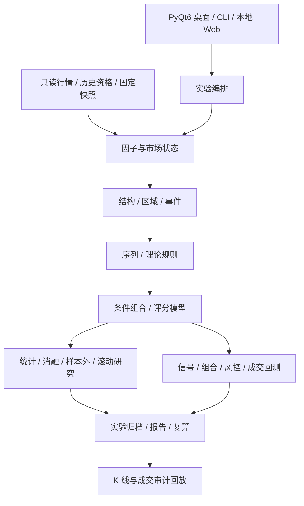

# 牛牛 · 统一技术交易因子实验平台

**简体中文** | [English](README.en.md)

<p align="center"></p>

**将交易理论拆成可计算、可检验、可回放的研究链路。**

牛牛是一个面向股票技术分析与量化研究的本地 Python 平台，提供 **PyQt6 原生桌面客户端、命令行研究内核和本地 Web 工作台**。它把行情、历史股票池、市场状态、结构、事件、序列、规则评分和独立成交回测接到同一套实验与归档体系中，帮助研究者回答：一个形态何时真正被确认？它在哪种市场状态下有效？组合是否优于单个输入？扣除交易成本后结果如何？

当前版本为 `0.1.0`，仍在持续开发。默认研究口径是**前复权（qfq）**；本项目以规则研究与离线验证为主，机器学习训练与实盘交易不在当前交付范围内。

[快速开始](#快速开始) · [功能](#核心功能) · [研究流程](#典型研究流程) · [数据要求](#数据要求与计算口径) · [当前边界](#当前边界)

## 这个库解决什么问题

传统技术分析经常将“看到了形态”“产生信号”和“可以成交”混在一起。牛牛分别记录这些阶段：

- **研究对象统一**：让不同理论复用因子、事件、区域、结构与序列对象，避免每套理论单独建设回测系统。
- **信息时间明确**：区分发生时间与 `available_at`，在确认后才使用结构和高周期信息，支持前缀一致性检查与回放审计。
- **假设可以比较**：保留市场背景、固定参数、消融、样本外和滚动研究结果，而不是只展示表现最好的参数。
- **统计与成交分开**：未来收益标签、IC 等预测指标不等于可成交收益；订单、拒单、持仓和净值由独立执行模块计算。
- **实验能够追溯**：记录配置、版本、源码及数据指纹，并按实验类型保存明细、报告、依赖和复算资料。

适合个人量化研究者、技术分析规则开发者，以及需要检查因果性和复现结果的研究团队。已有本地行情可以通过适配器接入；仓库不附带全市场行情或历史实验收益数据。

## 核心功能

| 模块 | 可使用的能力 |
|---|---|
| 原生桌面客户端 | 数据中心、因子库、市场状态、结构与事件、序列构建器、理论实验室、实验中心、组合与模型、策略回测和结果对比；业务表单、参数配置、任务状态与报告入口 |
| 数据与股票池 | MQC Parquet 只读读取、raw/qfq、数据质量审计、固定版本行情、历史上市区间、PIT 资格流水接口及 Baostock 参考资料归档 |
| 因子注册与计算 | 版本化 FactorPack、默认参数和依赖追踪；表达式及自定义计算路径；内容缓存与部分增量计算 |
| 市场状态与多周期 | 规则化趋势/区间、方向与波动状态；日线背景过滤；高周期信息按可用时间对齐；由 5m 合成完整交易时段的 15m/30m/60m |
| 结构、事件与序列 | 确认拐点、突破与失败突破、FVG、BOS、OB 等明确规则；顺序匹配、重复步骤、超时、失效、嵌套及事件链去重 |
| 规则组合与评分 | 条件组合、线性评分、因子预处理、截面排名与标准化；训练段拟合的预处理和残差投影 |
| 研究实验 | 单因子、消融、参数扫描、固定 train/valid/test、walk-forward、理论组件到组合的研究计划、相关性与冗余比较 |
| 科研统计 | IC/Rank IC、分位收益、MFE/MAE、日期分块 Bootstrap、置换与 Holm 校正、配对增量、子样本等效性及沪深分组验证 |
| 独立成交回测 | 下一根开盘模拟、现金与持仓、整手、T+1、费用和滑点、规则约束、目标与实际持仓差异、成交/拒单账本与净值 |
| 审计与复现 | K 线按日期定位、信号/事件/成交跳转、结构图层和实际周期切换；配置及产物归档、导出恢复和支持类型的数值复算 |
| 任务与续算 | 本地持久化任务状态；经典缠论状态检查点、追加行情续算与中断恢复。其他算法并非全部支持通用续算 |

桌面端还提供 **老板键 F12**：在 Mac 上隐藏应用及弹窗，点击 Dock 图标恢复；后台计算与未提交配置保留。部分键盘需按 `Fn + F12`。其他窗口系统使用最小化方式；目前原生操作验收主要在 macOS 上进行。

### 支持哪些理论

| 理论 / 因子族 | 实现范围与解释 |
|---|---|
| 基础技术因子 | 动量、ATR、收益波动、有符号方向效率、价格区间及其他明确技术规则 |
| 经典缠论 | K 线包含、分型、笔、线段、中枢、背驰与买卖点相关因子；事件序列、规则评分、状态续算和实际周期已确认线段嵌套 |
| 威克夫 | 明确价格/成交量规则下的事件、A–E 阶段、序列与研究链路；包含阈值、确认和失效条件 |
| Brooks | 趋势背景、回调、二次入场、突破回踩、测量目标和三极值收缩反转等规则化组件 |
| ICT / SMC | Sweep、Displacement、MSS、BOS、FVG、Order Block 等价格行为组件与组合序列 |
| Alpha101 / Alpha158 | 使用冻结的 vn.py 上游表达式：Alpha101 **82 项**，Alpha158 **158 项**；不是 101 项全量实现，也不自动代表论文级逐式复现 |

注册数量不等于理论覆盖率。`quantlab factors` 和 `quantlab theories` 可查询当前版本的注册项、参数和映射。Brooks、ICT、SMC、威克夫中的主观判断均需落为明确规则；项目不声称覆盖全部流派解释。

Alpha 公式的计算需要可选依赖 `vnpy`；查看注册信息或运行基础因子不需要安装交易后端。

## 架构



研究核心与 GUI、具体数据源及交易适配器分离。`src/quantlab/app.py` 负责组装默认注册表和运行器，`experiments/` 编排研究，`execution/` 计算交易账务，`storage/` 保存可追溯产物。`vn.py` 是可选离线适配器，不是桌面客户端框架。

## 快速开始

### 1. 环境与安装

需要 Python **3.11+**。主要依赖为 Polars、PyArrow、DuckDB；桌面端额外需要 PyQt6。当前开发与主要原生客户端验证环境为 macOS；其他平台需要单独验证其窗口行为及可选依赖兼容性。

```bash
git clone https://github.com/anyuzhe/niuniu.git
cd niuniu
python3 -m venv .venv
source .venv/bin/activate
python -m pip install -e ".[desktop]"
```

Windows PowerShell 使用 `.venv\Scripts\Activate.ps1` 激活环境。只使用 CLI 可安装 `python -m pip install -e .`。

按需安装数据抓取或 vn.py 功能：

```bash
python -m pip install -e ".[market_data]"
python -m pip install -e ".[vnpy]"
```

可选版本约束见 [pyproject.toml](pyproject.toml)。这里不自动安装券商 Gateway 或连接实盘账户。

### 2. 无行情先查看注册表与客户端

```bash
quantlab factors
quantlab theories
quantlab desktop --output ./artifacts
```

不提供数据目录可以浏览界面和注册信息；执行行情研究需要有效的数据源。

### 3. 接入自己的本地行情

将 `/path/to/MQC-DATA` 替换为实际 MQC 数据根目录：

```bash
quantlab desktop --data-root /path/to/MQC-DATA --output ./artifacts
```

等价的桌面入口：

```bash
python -m quantlab.desktop --data-root /path/to/MQC-DATA --output ./artifacts
```

仓库中的 macOS `.command` 启动脚本使用原开发机的 `/Volumes/Lexar/MQC-DATA` 路径；其他机器优先使用上述显式命令，或调整该路径。

### 4. 运行一个基础研究

以下命令要求指定股票在该区间有行情；日期、标的数量和预热长度应根据自己的数据调整。

```bash
quantlab run \
  --data-root /path/to/MQC-DATA --output ./artifacts \
  --symbols sh.600000 sz.000001 sh.600519 \
  --timeframe 1d --start 2024-01-01 --end 2024-12-31 \
  --factor BASE.MOMENTUM --lookback 20 \
  --horizons 1 5 20 --adjustment qfq --replay
```

命令输出及 `artifacts/` 中的报告用于检查本次研究。小样本仅适合验证流程，不能据此推断策略有效性。

### 5. 从评分模型进入成交回测

[examples/score.json](examples/score.json) 定义了动量和方向效率的线性评分：

```bash
quantlab run \
  --data-root /path/to/MQC-DATA --output ./artifacts \
  --symbols sh.600000 sz.000001 sh.600519 \
  --timeframe 1d --start 2024-01-01 --end 2024-12-31 \
  --factor COMB.SCORE --params-json examples/score.json \
  --adjustment qfq --backtest --execution-backend open --replay
```

高级参数可通过 `quantlab run --help` 查询，或从客户端业务表单配置并导出 JSON。可选本地 Web 工作台使用 `quantlab serve --data-root /path/to/MQC-DATA --output ./artifacts`；监听与端口选项见 `quantlab serve --help`。

## 典型研究流程

1. **数据中心**：确定股票、日期、周期和复权方式，检查缺失数据、历史上市资格和规则覆盖。
2. **市场状态与结构**：设定趋势/区间背景，选择已确认结构或事件，明确发生时间、确认时间与失效规则。
3. **序列与模型**：把事件组合成顺序链路，再构建条件组合或评分模型；模型在此指规则模型。
4. **科研验证**：先做单组件与完整组合对比，再做消融、样本外、滚动和多重检验；保存全部试验而非只保留优胜结果。
5. **策略回测**：配置组合、费用、滑点、交易限制及执行后端，检查真实持仓相对目标的偏差与拒单原因。
6. **客户端回放**：从日期、信号、事件或成交直接跳转 K 线；查看当时已经可用的结构和序列证据。
7. **归档复算**：保存配置及数据依赖，通过实验报告和支持的归档复算入口检查结果一致性。

缠论和威克夫可以走同一条链路；理论名称本身不会自动定义交易策略，仍需明确输入、评分、入场/退出和费用假设。

## 数据要求与计算口径

### 本地 MQC 目录

主要行情适配器为 [MQCParquetProvider](src/quantlab/data/mqc.py)，不是任意 CSV/Parquet 文件的自动识别器。

```text
MQC-DATA/
└── lake/
    ├── bronze/provider=baostock/
    │   ├── stock_kline_daily/sh_600000.parquet
    │   └── stock_kline_min5/sh_600000.parquet
    └── silver/
        ├── qfq_kline_daily/sh_600000.parquet
        └── qfq_kline_min5/sh_600000.parquet
```

每只股票独立文件。主要源字段为 `code`、`date`、`open`、`high`、`low`、`close`、`volume`、`amount`；分钟线还需 `time`，raw 行情须有 `adjustflag="3"`。复权因子 `factor` 用于相应价格与量额转换。日期类型、时间编码及内部标准化规则以适配器和 [行情校验](src/quantlab/data/validation.py) 为准；自定义来源可实现 [数据接口](src/quantlab/data/base.py)。

内部证券编码例如 `sh.600000`，时区为 `Asia/Shanghai`。日线按 15:00 可用、分钟线按结束时间解释。15m/30m/60m 从 5m 的完整交易时段合成，不以缺失分钟伪造完整 K 线。1m 需要独立真实源，不能由 5m 反推。

### 前复权与成交

- **客户端及研究 CLI 默认 qfq**。原始 MQC 数据只读；实验写入独立的 `artifacts/`。
- 默认 `execution.price_mode=research` 使用所选研究价格，并保留费用及滑点；前复权研究不再重复进行分红、送转或拆并股记账。
- 主动选择 `execution.price_mode=account` 才进入 raw 价格和显式公司行动账户模式；真实历史资料需由使用者提供。
- 底层 `MQCParquetProvider` / `build_runner` 的 Python 参数默认仍为 raw；直接调用 Python API 时请显式传入 `adjustment="qfq"`，不要把客户端默认值等同于底层默认值。
- 预测标签可以使用未来行情评估信号，但实际执行使用独立时钟。收盘产生因子不代表能以该根收盘价成交。
- 当前前复权文件不是严格历史时点可得性的自动证明；未来修订、股票预选和历史资格缺失仍需分别处理。

### 执行后端

| 后端 | 用途 |
|---|---|
| `open` | 默认独立回测引擎，按明确的开盘撮合及配置规则模拟 |
| `vnpy_open` | vn.py 原生撮合与账务对照的受限共同模型；不支持的费用/规则配置会拒绝，而不是忽略 |
| `vnpy_rules` | 与本平台规则和账务适配的 vn.py 离线执行路径 |

后两者需要可选依赖。现有适配不等于券商实盘通道，也不意味着具有真实 Tick/L2 流动性撮合能力。

## 实验产物与复现

默认输出目录 `artifacts/` 不提交到 Git。一次运行常见产物包括：

| 文件 | 内容 |
|---|---|
| `experiment.json` | 运行状态、配置、标识、数据/源码/依赖信息及指标 |
| `observations.parquet` | 因子观测及预测标签，依实验类型生成 |
| `report.md` | 可阅读的实验报告 |
| `bars.parquet` | 启用回放时保存的行情快照 |
| 其他明细 | 序列审计、成交、拒单、持仓和净值，依实验类型生成 |
| `experiments.duckdb` | 输出根目录中的本地实验索引 |

`experiment_id` 描述实验身份，`run_id` 标识一次执行。比较复现应检查配置、指标和明细，不能只比较目录名称。普通源文件指纹不等于复制了行情；要跨环境复算，需使用支持的归档导出流程并保留对应数据及依赖。已有开发记录中的本地报告、截图和大规模回测产物不随仓库发布。

## 项目目录

```text
src/quantlab/
├── app.py              # 默认注册与组装入口
├── data/               # 行情、历史资格、参考资料及快照
├── factors/            # 因子、理论组件、组合与增量状态
├── structure/ events/ zones/ regime/ sequence/
├── multitimeframe/     # 周期合成与可用时间对齐
├── processing/ statistics/ experiments/
├── execution/ adapters/ # 独立账务与可选 vn.py
├── storage/            # 索引、归档、导出及复算
├── desktop/            # PyQt6 客户端及资源
├── workbench/          # 本地 Web 工作台与任务队列
└── _vendor/            # 保留许可证和来源的上游缠论代码
examples/               # 参数样例与开发验收脚本
tests/                  # 核心、交易、统计、归档与桌面回归
```

部分历史验收脚本引用开发机路径及未公开的产物，运行前需调整；它们不都是开箱即用的演示。

## 测试与开发

```bash
# 不需要真实行情的核心回归
python -m unittest discover -s tests -p 'test_core.py' -v

# 桌面回归：使用 Qt 离屏平台，避免弹出测试窗口
QT_QPA_PLATFORM=offscreen python -m unittest discover -s tests -p 'test_desktop.py' -v

# 全量测试（可选依赖缺失时，部分用例可能跳过或无法运行）
python -m unittest discover -s tests -v
```

离屏 GUI 测试验证控件和应用逻辑，不替代真实客户端的键盘、窗口和系统集成验收。真实行情验收还需要本地数据与匹配的历史规则资料。

## 当前边界

- 部分复杂业务表单尚未逐项完成真实客户端验收。
- 历史行业全日期覆盖、可靠发布/可用时间、每日真实市值仍不完整；季度股本不能直接当成每日股本。真实资料下的中性化完整验收仍待完成。
- 官方逐日涨跌停价及特殊上市/退市规则覆盖尚不完整；合成规则回测不等于完整真实市场规则验收。
- 缠论以外递归算法及复杂父研究的通用断点续算仍未完成。
- 部分理论剩余规则、独立等高/等低流动性池生命周期尚未覆盖；主观解释不自动转为可验证算法。
- Tick/L2 与 OrderFlow 暂不推进；连续 Paper 的后续建设已暂停。已有 Paper 代码保留，但不作为当前持续运行交付承诺。
- 机器学习训练和实盘连接不在当前范围。任何回测结果都只是给定数据和假设下的研究结果。

## 深入文档与来源

- [总体方案与架构说明](统一技术交易因子实验平台_总体方案与架构说明.md)：目标设计，包含尚未实现的部分。
- [PyQt 桌面说明](PyQt桌面界面说明.md)、[核心建设进度](核心功能建设进度.md)：中文技术及阶段记录；历史产物链接仅在原开发环境可用。
- [威克夫 A–E 规则与链路](威克夫_AE规则与因子链路.md)、[缠论确认推进规则](Chan确认推进_线段背驰与买卖点规则.md)。
- [跨实验试验登记与 Holm 校正](跨实验试验登记与Holm校正规则.md)。
- [历史开发说明](DEVELOPMENT_HISTORY.zh-CN.md)：原 README 的历次记录，可能包含过期默认值；当前使用入口以本 README 为准。
- 缠论上游来源及本地修改：[PROVENANCE.json](src/quantlab/_vendor/chanpy/PROVENANCE.json)、[MIT 许可证](src/quantlab/_vendor/chanpy/LICENSE)。
- Alpha 表达式来源及限制：[ALPHA_PROVENANCE.md](src/quantlab/factors/ALPHA_PROVENANCE.md)、[上游许可证](src/quantlab/factors/ALPHA_LICENSE)。

仓库目前未为项目自身另行声明统一开源许可证；随附第三方许可证只适用于对应代码，不能视为对整个项目的授权。

[English →](README.en.md)
