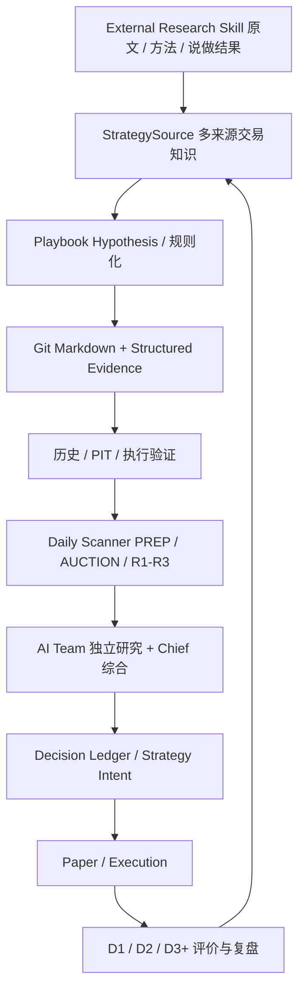

# 牛牛 AI · 个人 A 股交易研究助手

**简体中文** | [English](README.en.md)

<p align="center"></p>

**把多来源交易知识持续形式化、数据验证化，并形成可追溯的每日交易研究闭环。**

牛牛是一个面向个人 A 股交易研究的本地 AI 系统，提供 **Trading Desk、AI Team、Trading Knowledge / Playbook Lab、Research Lab、PyQt6 桌面客户端、CLI、MCP 与本地 Web 工作台**。它不把某位高手、某个因子或某套理论当作系统中心，而是把实盘交易者、用户经验、公开方法、历史案例、统计发现和系统复盘统一视为“策略来源”，经过规则化、结构化留证、历史/前瞻验证、Daily Scanner、AI 研究、Decision Ledger 与复盘后持续迭代。

原有严谨量化研究内核完整保留，继续负责 Factor、Experiment、PIT、Campaign、Alpha Factory、Watch、统计和独立成交验证。当前版本仍在持续开发；默认研究口径为**前复权（qfq）**。自动实盘和真实券商接入不是当前默认能力，策略意图、Paper Position 与未来 Real Position 始终分离。

[快速开始](#快速开始) · [功能](#核心功能) · [研究流程](#典型研究流程) · [数据要求](#数据要求与计算口径) · [当前边界](#当前边界)

## 当前产品定位

牛牛当前采用两套互补视角：**产品模块架构**回答“软件怎么组织”，**交易知识与决策循环**回答“知识怎样进入系统并形成交易判断”。

```text
交易知识 / 策略来源
  ↓
Playbook Hypothesis / 规则化
  ↓
Git Markdown + Structured Evidence 双轨存储
  ↓
历史数据 / Strict PIT / 执行验证
  ↓
Daily Scanner：PREP → AUCTION → R1/R2/R3
  ↓
AI Team 独立研究 + Chief 综合
  ↓
Decision Ledger / Strategy Intent
  ↓
Paper / Execution
  ↓
D1 / D2 / D3+ 复盘
  ↓
新经验 / 新反例 / 新规则版本
```

“期末50分”只是当前第一个 `TRADER` 类型来源试点，不是一级架构模块。真正长期积累的是可版本化、可验证、可前瞻检验的 Playbook。完整架构见 [项目说明与总体架构](牛牛AI交易助手_项目说明与总体架构.md)。

## 这个库解决什么问题

传统技术分析经常将“看到了形态”“产生信号”和“可以成交”混在一起。牛牛分别记录这些阶段：

- **研究对象统一**：让不同理论复用因子、事件、区域、结构与序列对象，避免每套理论单独建设回测系统。
- **信息时间明确**：区分发生时间与 `available_at`，在确认后才使用结构和高周期信息，支持前缀一致性检查与回放审计。
- **假设可以比较**：保留市场背景、固定参数、消融、样本外和滚动研究结果，而不是只展示表现最好的参数。
- **统计与成交分开**：未来收益标签、IC 等预测指标不等于可成交收益；订单、拒单、持仓和净值由独立执行模块计算。
- **实验能够追溯**：记录配置、版本、源码及数据指纹，并按实验类型保存明细、报告、依赖和复算资料。

适合个人量化研究者、技术分析规则开发者，以及需要检查因果性和复现结果的研究团队。已有本地行情可以通过适配器接入；仓库不附带全市场行情或历史实验收益数据。

## 核心功能

| 模块 | 可使用的能力 |
|---|---|
| 原生桌面客户端 | 数据中心、因子库、市场状态、结构与事件、序列构建器、理论实验室、实验中心、组合与模型、策略回测和结果对比；业务表单、参数配置、任务状态与报告入口 |
| 数据与股票池 | MQC Parquet 只读读取、raw/qfq、数据质量审计、固定版本行情、历史上市区间、PIT 资格流水接口及 Baostock 参考资料归档 |
| 数据资格 | 请求级 `research_only / retrospective_reference / strict_pit / official_rule_covered`；严格请求按 bar vintage、复权信息、外部字段、PIT 股票池/中性化控制和逐日官方规则阻断；PIT Universe/SecurityStatus/行业/市值及 MarketRules 都必须绑定本地官方原文 + publication-time receipt；Coverage 只显示 evidence presence 与回顾性 inventory，不生成数据集总证书 |
| 因子注册与计算 | 版本化 FactorPack、默认参数和依赖追踪；表达式及自定义计算路径；内容缓存与部分增量计算 |
| 市场状态与多周期 | 规则化趋势/区间、方向与波动状态；日线背景过滤；高周期信息按可用时间对齐；由 5m 合成完整交易时段的 15m/30m/60m |
| 结构、事件与序列 | 确认拐点、突破与失败突破、FVG、BOS、OB 等明确规则；顺序匹配、重复步骤、超时、失效、嵌套及事件链去重 |
| 规则组合与评分 | 条件组合、线性评分、因子预处理、截面排名与标准化；训练段拟合的预处理和残差投影 |
| 研究实验 | 单因子、消融、参数扫描、固定 train/valid/test、walk-forward、理论组件到组合的研究计划、相关性与冗余比较 |
| 科研统计 | IC/Rank IC、分位收益、MFE/MAE、日期分块 Bootstrap、置换与 Holm 校正、配对增量、子样本等效性及沪深分组验证 |
| 独立成交回测 | 下一根开盘模拟、现金与持仓、整手、T+1、费用和滑点、规则约束、目标与实际持仓差异、成交/拒单账本与净值 |
| 审计与复现 | K 线按日期定位、信号/事件/成交跳转、结构图层和实际周期切换；配置及产物归档、导出恢复和支持类型的数值复算 |
| 任务与续算 | 本地持久化任务状态；经典缠论状态检查点、追加行情续算与中断恢复。其他算法并非全部支持通用续算 |
| Trading Desk | 今日交易驾驶舱、Decision Ledger、Stock Dossier、Theme Matrix、Decision Frame、Strategy Intent、Playbook Decision Bridge 与 PaperPlan 只读状态；预测、策略意图、模拟成交与未来真实持仓严格分离 |
| Trading Knowledge / Playbook Lab | 已支持六类 `StrategySource`、旧 `ExpertSource→TRADER` 兼容投影、Playbook 多对多来源关系、完整 CandidateSet、selected/unselected、Selection/Veto、前瞻冻结、历史回放与执行访问分层 |
| External Research Skill | 外部专家/机构知识的只读边界适配：固定包内资源，并把宿主已下载的 Git origin/commit/tree/tracked blobs 归档到独立数据根；核 SHA256、时点、逐字 quote、claim/“说做结果”，只生成 PENDING/PARTIAL StrategySource 预览，不执行外部脚本、不写 Playbook/Decision/交易 |
| Daily Scanner / 每日编排 | PREP 全市场扫描、MarketSnapshot、AUCTION/R1/R2/R3 确定性扫描、DailyMarket 全市场日增量归档，以及持久 `Daily Orchestrator` 五阶段幂等可恢复链路；腾讯主源+东财第二源+新浪备用校验的 live Provider 已接入；错过窗口不回填；空 PREP CandidateSet 以 `COMPLETE_NO_TRADE` 正常结束 |
| AI Team | Chief Researcher、Market Scanner、Skeptic、Quant Researcher 与按需 Peer Review；第一轮独立判断，Chief 综合，不用多数票代替证据 |
| AI 研究与自动化基础 | 结构化研究记忆、固定研究包、受限 DSL、Research Agenda、Safe Alpha Factory、Watch + Sequential Monitor、标准 MCP、approval-time actual-byte freeze 与 Research Session Grant；新 Watch 可冻结序贯 Rank IC 衰减门槛，但模型不能自动停因子、换参数、扩大授权或实盘 |
| System Health | P11 只读聚合 Workspace、Artifacts、JobQueue、daemon heartbeat、MCP adapter、Notifications、Market Data/Series、DailyMarket、MarketSnapshot、Orchestrator、PIT/Playbook、Paper、Dev Studio 与日志；MarketRules v2 显示全局深度审计 inventory；运行在线和研究正确分轴，无健康总分/自动修复 |
| Mobile / Bot | P12 轻客户端：同一 Workbench 提供 `/mobile` 与只读 JSON API，MCP/CLI 提供 Mobile Brief；直接复用 Decision Ledger、Stock Dossier、Paper、System Health 与统一记忆/状态源，不建立手机端第二数据库或第二份持仓 |
| Broker Shadow | P13-A 只读券商证据层：脱敏账户快照 append-only 保存，与 Dynamic Paper 比较持仓/现金；MCP 只读查询，无券商登录、认证保存、下单、撤单或资金划转 |
| RealTrade Readiness | P13-B0 fail-closed 实盘安全门：Broker capability、禁用态 safety policy、账户快照新鲜度、Shadow、认证/kill switch/风险限额/人工确认/订单 Gateway/回执链 blocker；当前无券商通道时始终 BLOCKED |

桌面端还提供 **老板键 F12**：在 Mac 上隐藏应用及弹窗，点击 Dock 图标恢复；后台计算与未提交配置保留。部分键盘需按 `Fn + F12`。其他窗口系统使用最小化方式；目前原生操作验收主要在 macOS 上进行。

### 支持哪些理论

| 理论 / 因子族 | 实现范围与解释 |
|---|---|
| 基础技术因子 | 动量、ATR、收益波动、有符号方向效率、价格区间及其他明确技术规则 |
| 经典缠论 | K 线包含、分型、笔、线段、中枢、背驰与买卖点相关因子；事件序列、规则评分、状态续算和实际周期已确认线段嵌套 |
| 威克夫 | 明确价格/成交量规则下的事件、A–E 阶段、序列与研究链路；包含阈值、确认和失效条件 |
| Brooks | 趋势背景、回调、二次入场、突破回踩、测量目标和三极值收缩反转等规则化组件 |
| ICT / SMC | Sweep、Displacement、MSS、BOS、FVG、Order Block 等价格行为组件与组合序列 |
| Alpha101 / Alpha158 | 使用冻结的 vn.py 上游表达式：Alpha101 **82 项**，Alpha158 **158 项**；不是 101 项全量实现，也不自动代表论文级逐式复现 |

注册数量不等于理论覆盖率。`quantlab factors` 和 `quantlab theories` 可查询当前版本的注册项、参数和映射。Brooks、ICT、SMC、威克夫中的主观判断均需落为明确规则；项目不声称覆盖全部流派解释。

Alpha 公式的计算需要可选依赖 `vnpy`；查看注册信息或运行基础因子不需要安装交易后端。

## 架构

### 产品模块架构

```text
牛牛 AI
├─ Trading Desk：今日交易 / 主线市场 / 股票中心 / 持仓计划 / 复盘
├─ AI Team：Chief / Scanner / Skeptic / Quant Researcher
├─ Research Lab
│  ├─ Factor / Experiment / PIT / Campaign / Factory / Watch
│  ├─ External Research Skills（只读知识边界；无自动脚本/交易）
│  └─ Trading Knowledge / Playbook Lab
├─ Dev Studio（P10 v1 已完成）
├─ System Center（P11 v1 已完成）：Data / PIT / Jobs / MCP / daemon / notifications / health
├─ Mobile / Bot（P12 v1 已完成）：同源只读 Brief / Stock Dossier / Decision / Health
├─ Broker Shadow（P13-A v1 已完成）：只读账户快照 / Dynamic Paper 对账；无实盘连接与订单
└─ RealTrade Readiness（P13-B0 v1 已完成）：无券商通道时 fail-closed；B1 等待具体实时只读通道
```

### 交易知识与决策循环



### Research Lab 确定性内核

原来的量化实验架构仍完整保留，只是从“整个产品本身”下沉为 Research Lab：行情与资格 → 因子/状态 → 结构/事件 → 序列/规则 → 组合模型 → 统计/样本外/执行 → 归档复算。

研究核心与 GUI、具体数据源及交易适配器分离。`src/quantlab/app.py` 负责组装默认注册表和运行器，`experiments/` 编排研究，`execution/` 计算交易账务，`storage/` 保存可追溯产物；Trading Desk / Playbook / Agent 层引用这些确定性证据，而不复制一套数值研究逻辑。`vn.py` 是可选离线适配器，不是桌面客户端框架。

## 快速开始

### 1. 环境与安装

需要 Python **3.11+**。主要依赖为 Polars、PyArrow、DuckDB；桌面端额外需要 PyQt6。当前开发与主要原生客户端验证环境为 macOS；其他平台需要单独验证其窗口行为及可选依赖兼容性。

```bash
git clone https://github.com/anyuzhe/niuniu.git
cd niuniu
python3 -m venv .venv
source .venv/bin/activate
python -m pip install -e ".[desktop]"
```

Windows PowerShell 使用 `.venv\Scripts\Activate.ps1` 激活环境。只使用 CLI 可安装 `python -m pip install -e .`。

按需安装数据抓取或 vn.py 功能：

```bash
python -m pip install -e ".[market_data]"
python -m pip install -e ".[vnpy]"
python -m pip install -e ".[mcp]"
```

可选版本约束见 [pyproject.toml](pyproject.toml)。这里不自动安装券商 Gateway 或连接实盘账户。

### 2. 无行情先查看注册表与客户端

```bash
quantlab factors
quantlab theories
quantlab desktop --output ./artifacts
```

不提供数据目录可以浏览界面和注册信息；执行行情研究需要有效的数据源。

### 标准 MCP 与常驻跟踪

安装 `.[mcp]` 后，本机智能体可用 `niuniu-mcp --output ./artifacts --data-root /path/to/data` 通过 stdio 连接。需要 HTTP 时使用 `--transport streamable-http --host 127.0.0.1 --port 8766`；程序拒绝非回环监听，跨机器请使用 SSH 隧道或有认证的反向代理。MCP 只暴露现有模型工具，不增加下载、批准、执行、DSL 注册或跟踪授权权限。

桌面退出后可运行 `niuniu-tracking-daemon --output ./artifacts --data-root /path/to/data`。守护进程只执行已经由宿主保存的跟踪授权，并与桌面共享原 `JobQueue` 单 worker 边界。`quantlab tracking-launchd-write ...` 可以生成 macOS LaunchAgent plist，但不会自动加载或创建授权。

外部专家/机构知识包先运行 `quantlab research-skill-audit --package research_skills/<skill>`。该命令只读本地资源并生成 StrategySource 预览，不联网、不执行包内脚本，也不写 Playbook Lab。宿主已授权 clone 的仓库可用 `research-skill-git-archive` 固定 origin/commit/tree 和全部 tracked blobs，再以 `research-skill-git-audit` 深验、`research-skill-git-curate --confirm-retrospective-only` 选择性生成独立数据根 DRAFT 包；三个命令自身均不 clone/fetch。郑希上游已固定至 commit `304ac3e4...bebb536`，143个文件/11,367,050 bytes 的 archive receipt 验证通过；首个14资源策展包含1份上游访谈、001513持仓与净值快照、10条 claim 和1组“说/做/结果”，但来源真实性仍需宿主复核、发布时间未验证，不具 Strict PIT/Alpha/Scanner/交易资格，也未写入 StrategySource 或 Playbook。

每日 Playbook 编排使用 `niuniu-daily-orchestrator`。宿主先用 `--init` 为**单个交易日**冻结 definition、上一交易日和可选 target_streak；默认不联网，只有显式 `--allow-daily-market-capture` 才允许在数据就绪后抓取 DailyMarket。之后可用 `--tick` 单步运行或 `--run` 以固定轮询持续到该日终态。当前已编排 PREP/AUCTION/R1/R2/R3：R2 在 11:30 午间收盘复核，R3 在 15:00 收盘定稿；R2/R3 必须引用前一阶段真实冻结的 SYSTEM_PREDICTION，只延续其中已选标的，不新增股票。实时行情现已可由 `public-web-consensus-v1` 生成：腾讯主源、东方财富第二源、新浪备用校验；至少两源一致才形成可用证券快照。Daily Orchestrator 默认仍不联网，初始化计划时显式 `--allow-market-snapshot-capture` 才会自动抓 AUCTION/R1/R2/R3。PREP CandidateSet 为空时，系统先保存可选的 Trading Desk NO_TRADE receipt，再以 `COMPLETE_NO_TRADE` 终止并把后续 Frame 标为 `SKIPPED_NO_TRADE`，不会请求无标的实时行情；这与“CandidateSet 非空但 PREP 暂不提前选具体股票”严格区分。公开网页行情固定不认证 Strict PIT，未来券商/QMT 可替代为正式主源。

### 3. 接入自己的本地行情

将 `/path/to/niuniu-data` 替换为实际 MQC 数据根目录：

```bash
quantlab desktop --data-root /path/to/niuniu-data --output ./artifacts
```

等价的桌面入口：

```bash
python -m quantlab.desktop --data-root /path/to/niuniu-data --output ./artifacts
```

仓库中的 macOS `.command` 启动脚本使用原开发机的 `/Volumes/Lexar/niuniu-data` 路径；其他机器优先使用上述显式命令，或调整该路径。

### 4. 运行一个基础研究

以下命令要求指定股票在该区间有行情；日期、标的数量和预热长度应根据自己的数据调整。

```bash
quantlab run \
  --data-root /path/to/niuniu-data --output ./artifacts \
  --symbols sh.600000 sz.000001 sh.600519 \
  --timeframe 1d --start 2024-01-01 --end 2024-12-31 \
  --factor BASE.MOMENTUM --lookback 20 \
  --horizons 1 5 20 --adjustment qfq --replay
```

命令输出及 `artifacts/` 中的报告用于检查本次研究。小样本仅适合验证流程，不能据此推断策略有效性。

### 5. 从评分模型进入成交回测

[examples/score.json](examples/score.json) 定义了动量和方向效率的线性评分：

```bash
quantlab run \
  --data-root /path/to/niuniu-data --output ./artifacts \
  --symbols sh.600000 sz.000001 sh.600519 \
  --timeframe 1d --start 2024-01-01 --end 2024-12-31 \
  --factor COMB.SCORE --params-json examples/score.json \
  --adjustment qfq --backtest --execution-backend open --replay
```

高级参数可通过 `quantlab run --help` 查询，或从客户端业务表单配置并导出 JSON。可选本地 Web 工作台使用 `quantlab serve --data-root /path/to/niuniu-data --output ./artifacts`；监听与端口选项见 `quantlab serve --help`。

## 典型研究流程

### 交易知识到每日决策

1. **来源归档**：记录交易者、用户经验、公开方法、历史案例、统计发现或系统复盘来源；来源不是规则本身。
2. **Playbook 提炼**：抽取市场上下文、eligibility、selection、veto、entry/confirm/invalidation/exit，先保存为 DRAFT。
3. **双轨留证**：人类可读规则进入 Git/Markdown；候选全集、时点事实、预测、验证、成交和收益进入 Structured Evidence。
4. **历史与执行验证**：重建完整 CandidateSet，区分 Eligibility、Selection、Execution Access 和账户收益，按需要使用 Strict PIT、Holdout、Walk-forward、成本和 A 股制度审计。
5. **Daily Scanner**：PREP 生成市场节点/目标身位/候选全集，AUCTION 与 R1/R2/R3 只消费当时可见快照，证据不足则 UNKNOWN/NO_TRADE。
6. **AI Team**：多个角色独立检查覆盖、反例和量化证据，Chief 综合并保留分歧，不采用简单投票。
7. **Decision / Intent**：当时判断写入 append-only Decision Ledger，再形成 WATCH/READY/PLAN_OPEN/HOLD/EXIT 等 Strategy Intent。
8. **执行与复盘**：Paper/Execution 独立处理成交限制，D1/D2/D3+ 对照原判；新经验作为新的 StrategySource 回到下一版 Playbook。

### Research Lab 子流程

原有因子/理论研究仍按“数据资格 → 状态/结构/事件 → 序列/模型 → 科研验证 → 成交回测 → 回放 → 归档复算”运行。缠论、威克夫、Brooks、ICT/SMC 和因子研究都是 Playbook 的证据与特征来源之一，不自动等于生产交易策略。

## 数据要求与计算口径

### 本地 MQC 目录

主要行情适配器为 [MQCParquetProvider](src/quantlab/data/mqc.py)，不是任意 CSV/Parquet 文件的自动识别器。

```text
niuniu-data/
└── lake/
    ├── bronze/provider=baostock/
    │   ├── stock_kline_daily/sh_600000.parquet
    │   └── stock_kline_min5/sh_600000.parquet
    └── silver/
        ├── qfq_kline_daily/sh_600000.parquet
        └── qfq_kline_min5/sh_600000.parquet
```

每只股票独立文件。主要源字段为 `code`、`date`、`open`、`high`、`low`、`close`、`volume`、`amount`；分钟线还需 `time`，raw 行情须有 `adjustflag="3"`。复权因子 `factor` 用于相应价格与量额转换。日期类型、时间编码及内部标准化规则以适配器和 [行情校验](src/quantlab/data/validation.py) 为准；自定义来源可实现 [数据接口](src/quantlab/data/base.py)。

内部证券编码例如 `sh.600000`，时区为 `Asia/Shanghai`。日线按 15:00 可用、分钟线按结束时间解释。15m/30m/60m 从 5m 的完整交易时段合成，不以缺失分钟伪造完整 K 线。1m 需要独立真实源，不能由 5m 反推。

### 前复权与成交

- **客户端及研究 CLI 默认 qfq**。原始 MQC 数据只读；实验写入独立的 `artifacts/`。
- 默认 `execution.price_mode=research` 使用所选研究价格，并保留费用及滑点；前复权研究不再重复进行分红、送转或拆并股记账。
- 主动选择 `execution.price_mode=account` 才进入 raw 价格和显式公司行动账户模式；真实历史资料需由使用者提供。
- 底层 `MQCParquetProvider` / `build_runner` 的 Python 参数默认仍为 raw；直接调用 Python API 时请显式传入 `adjustment="qfq"`，不要把客户端默认值等同于底层默认值。
- 预测标签可以使用未来行情评估信号，但实际执行使用独立时钟。收盘产生因子不代表能以该根收盘价成交。
- 当前前复权文件不是严格历史时点可得性的自动证明；未来修订、股票预选和历史资格缺失仍需分别处理。

### 执行后端

| 后端 | 用途 |
|---|---|
| `open` | 默认独立回测引擎，按明确的开盘撮合及配置规则模拟 |
| `vnpy_open` | vn.py 原生撮合与账务对照的受限共同模型；不支持的费用/规则配置会拒绝，而不是忽略 |
| `vnpy_rules` | 与本平台规则和账务适配的 vn.py 离线执行路径 |

后两者需要可选依赖。现有适配不等于券商实盘通道，也不意味着具有真实 Tick/L2 流动性撮合能力。

## 实验产物与复现

默认输出目录 `artifacts/` 不提交到 Git。一次运行常见产物包括：

| 文件 | 内容 |
|---|---|
| `experiment.json` | 运行状态、配置、标识、数据/源码/依赖信息及指标 |
| `observations.parquet` | 因子观测及预测标签，依实验类型生成 |
| `report.md` | 可阅读的实验报告 |
| `bars.parquet` | 启用回放时保存的行情快照 |
| 其他明细 | 序列审计、成交、拒单、持仓和净值，依实验类型生成 |
| `experiments.duckdb` | 输出根目录中的本地实验索引 |

`experiment_id` 描述实验身份，`run_id` 标识一次执行。比较复现应检查配置、指标和明细，不能只比较目录名称。普通源文件指纹不等于复制了行情；要跨环境复算，需使用支持的归档导出流程并保留对应数据及依赖。已有开发记录中的本地报告、截图和大规模回测产物不随仓库发布。

## 项目目录

```text
src/quantlab/
├── app.py              # 默认注册与组装入口
├── data/               # 行情、历史资格、参考资料及快照
├── factors/            # 因子、理论组件、组合与增量状态
├── structure/ events/ zones/ regime/ sequence/
├── multitimeframe/     # 周期合成与可用时间对齐
├── processing/ statistics/ experiments/
├── execution/ adapters/ # 独立账务与可选 vn.py
├── storage/            # 索引、归档、导出及复算
├── desktop/            # PyQt6 客户端及资源
├── workbench/          # 本地 Web 工作台与任务队列
└── _vendor/            # 保留许可证和来源的上游缠论代码
examples/               # 参数样例与开发验收脚本
tests/                  # 核心、交易、统计、归档与桌面回归
```

部分历史验收脚本引用开发机路径及未公开的产物，运行前需调整；它们不都是开箱即用的演示。

## 测试与开发

```bash
# 不需要真实行情的核心回归
python -m unittest discover -s tests -p 'test_core.py' -v

# 桌面回归：使用 Qt 离屏平台，避免弹出测试窗口
QT_QPA_PLATFORM=offscreen python -m unittest discover -s tests -p 'test_desktop.py' -v

# 全量测试（可选依赖缺失时，部分用例可能跳过或无法运行）
python -m unittest discover -s tests -v
```

离屏 GUI 测试验证控件和应用逻辑，不替代真实客户端的键盘、窗口和系统集成验收。真实行情验收还需要本地数据与匹配的历史规则资料。

## 当前边界

- 2026-09-15 已接受首个当前工作空间 DailyMarket day（5,219行）并在合法 PREP 时间窗冻结 2026-09-16 前瞻结果；市场节点为 `EXTREME_RISK`，空 CandidateSet 正常进入 `COMPLETE_NO_TRADE`。该样本为 `PARTIAL / RETROSPECTIVE_REFERENCE`，没有 PaperPlan/成交，也不证明 Strict PIT 或策略有效。
- 部分复杂业务表单尚未逐项完成真实客户端验收。
- Strict PIT Evidence Archive v1 已支持四类 statement：PIT Universe、SecurityStatus、历史行业、每日市值。当前 `/Volumes/Lexar/niuniu-data` 已有 `security_status=14` verified receipts（7只深市股票的明确停牌/复牌及 ST 生效事件），其它三类仍为0；这不代表历史状态链完整。季度股本不能直接当成每日股本。
- Strict PIT Coverage v1 已完成：按年份/证券/字段统计经过深度校验的 evidence presence，并把 `stock_basic`、单快照行业、历史 bar lake 等回顾性资料单独列为 inventory。当前日线仍是5215个证券文件、17,075,243行（1990-12-19～2026-09-04），bar lake 本身无 `tradestatus/isST`；现有14条 SecurityStatus 只覆盖7只股票的明确事件日，Coverage 不输出伪造总完成率。
- Official MarketRules publication receipt v2 已完成 append-only、实际 records、官方原文 SHA256 与 `published_at <= available_at` 验证；`official-rule-audit` 和 System Health 可全局深度核验。当前真实数据仍为1个 verified snapshot、7只证券各1个明确停牌 session（7/7 audit covered）。另已用深交所公告比例、2023交易规则公式/舍入及官方历史 `qss` 核出7组复牌 exact 算术值，并由 `official-rule-reference-audit` 深验回顾性参考包；由于行情响应是在 session 后取得，缺开盘前 publication receipt，`strict_pit_eligible=false` 且没有追加 MarketRules。全市场逐日价格边界及特殊上市/退市规则仍缺。
- External Research Skill Git archive/curation 已接入：Git 跟踪的郑希控制包仍为 `SOURCE_REQUIRED`，第三方字节不进仓库；独立数据根中已有固定 `304ac3e4...bebb536` 的 verified archive 和 `f9e72ecd...74bf10` DRAFT 策展包。策展包的逐字 claim/“说做结果”结构完整，但上游二次整理不等于官方原始字节，publication time 和 source identity 仍未验证，Quant Validation 尚未开始。
- 缠论以外递归算法及复杂父研究的通用断点续算仍未完成。
- 部分理论剩余规则、独立等高/等低流动性池生命周期尚未覆盖；主观解释不自动转为可验证算法。
- Tick/L2 与 OrderFlow 暂不推进；P8.8-C 已实现动态跨日 universe Paper、成交回执驱动 Intent、ADD/REDUCE/EXIT 再平衡、D1/D2/D3+ 因果复盘和生命周期统计，但尚未积累数月真实前瞻 Paper 运行样本，不能把“代码闭环完成”写成“长期实盘表现已验证”。
- P8.7 Daily Orchestrator 已完成 PREP/AUCTION/R1/R2/R3；`public-web-consensus-v1` 已接入腾讯/东财/新浪三源实时行情。三源至少两源一致才可用，单源异常可剔除；该层适合当前研发/个人自用，但无交易所级 SLA，且固定 `strict_pit_source_verified=false`。P9 Agent Scorecard、P10 Dev Studio、P11 System Health、P12 Mobile / Bot、P13-A Broker Shadow 与 P13-B0 RealTrade Readiness v1 均已完成。B0 已把当前“没有具体券商通道”编码为 `NO_LIVE_BROKER_CHANNEL`。
- 下一层 P13-B1 只有出现明确可用的具体券商实时**只读**通道后才开始；认证/密钥、真实资金与任何下单/撤单/资金划转仍未启用。B2/B3 若涉及风险门、kill switch、逐单人工确认、订单 Gateway 或真实订单，必须继续单独评审。任何 Paper/Shadow/完整 policy/Agent 判断都不能自动外推为实盘权限。
- Research Proposal 已完成 approval-time actual-byte freeze；Research Session Grant v1 也已完成：宿主可按证券/日期/周期/因子/模式/有效期与总预算授予有限自主研究，模型只能在该范围内向同一 JobQueue 提交任务，每项仍冻结实际输入；撤销/过期后新任务立即禁止、运行任务在 checkpoint 取消。
- Watch Sequential Monitor v1 已完成：新 Watch 创建时冻结 family alpha、最小 Rank IC 衰减幅度、新增成熟日期门槛与非重叠 block；重复查看使用 e-process 控制，历史修订/样本不足 fail-closed。旧 Watch 不静默升级，衰减证据只进入人工复核 Agenda，不自动停用/换参数。

## 深入文档与来源

- [牛牛 AI 项目说明与总体架构](牛牛AI交易助手_项目说明与总体架构.md)：当前项目定位、StrategySource / Playbook / Daily Decision 主循环和完成度边界。
- [A股交易工作台改造总计划](牛牛AI交易助手_A股交易工作台改造总计划.md)：P1～P13 与架构 v2 的正式开发路线。
- [P9 Agent Scorecard 验收说明](牛牛AI交易工作台_P9AgentScorecard_验收说明.md)：按任务类型评价、样本门槛、System Baseline 与无总分/无自动调权边界。
- [P10 Dev Studio 验收说明](牛牛AI交易工作台_P10DevStudio动态Agent_验收说明.md)：isolated worktree、动态 Subagents、path lease、frozen tests、Reviewer 与 Human Merge Gate。
- [P11 System Health 验收说明](牛牛AI交易工作台_P11SystemHealth_验收说明.md)：Runtime/Research Readiness 双轴、服务/任务/数据/PIT/通知/Dev 只读健康证据与无自动修复边界。
- [P12 移动端 / 机器人验收说明](牛牛AI交易工作台_P12移动端与机器人_验收说明.md)：同源 Mobile Brief、手机 Web、Stock Dossier、Decision/System Health JSON API、MCP/CLI 与无第二状态边界。
- [P13-A 券商只读与 Shadow 对账验收说明](牛牛AI交易工作台_P13A券商只读与Shadow对账_验收说明.md)：脱敏账户快照、append-only Broker evidence、Dynamic Paper 对账、MCP 只读和无实盘权限边界。
- [P13-B0 实盘安全门验收说明](牛牛AI交易工作台_P13B0实盘安全门_验收说明.md)：Broker capability、禁用态 safety policy、fail-closed readiness、无券商通道 blocker 与 B1/B2/B3 后续分层。
- [P8.7 R2/R3 与 MarketSnapshot Provider 验收说明](牛牛AI交易工作台_P8_7R2R3与MarketSnapshotProvider_验收说明.md)：午间/收盘 continuation review、五阶段 Orchestrator 与正式 Provider fail-closed 能力合同。
- [三源实时 MarketSnapshot Provider v1 验收说明](牛牛AI交易工作台_三源实时MarketSnapshotProvider_验收说明.md)：腾讯主源、东财第二源、新浪备用校验、两源共识、时间戳防脏数据、Strict PIT 边界与 Orchestrator 显式联网授权。
- [Approval-time Actual-byte Freeze 验收说明](牛牛AI交易工作台_ApprovalTimeActualByteFreeze_验收说明.md)：宿主批准时冻结实际研究输入字节、Universe mask、qfq/raw/context，并从冻结包执行/恢复。
- [Research Session Grant v1 验收说明](牛牛AI交易工作台_ResearchSessionGrant_验收说明.md)：宿主有限授权、预算/范围/有效期、共享 JobQueue、逐任务实际输入冻结、撤销/过期 fail-closed。
- [Watch 序贯统计与 Alpha 衰减监测 v1 验收说明](牛牛AI交易工作台_Watch序贯统计与Alpha衰减监测_验收说明.md)：冻结经验基线、非重叠 block、anytime-valid e-process、legacy Watch 兼容与无自动停用边界。
- [Strict PIT Evidence Archive v1 验收说明](牛牛AI交易工作台_StrictPITEvidenceArchive_验收说明.md)：历史资格/行业/市值 statement 与官方原文 SHA256、publication time 的 receipt 绑定、Strict PIT 升级门和真实覆盖仍为 0 的边界。
- [Strict PIT Coverage v1 验收说明](牛牛AI交易工作台_StrictPITCoverage_验收说明.md)：按年份/证券的 strict evidence presence、真实 MQC 回顾性 inventory、gap codes、只读 CLI/AI/UI 与无总完成率边界。
- [Strict PIT SecurityStatus v1 验收说明](牛牛AI交易工作台_StrictPITSecurityStatus_验收说明.md)：首批真实ST/停复牌官方证据、派生表、PREP接线、稀疏事件不跨日外推与无价格规则推断边界。
- [Strict PIT SecurityStatus 第二批验收说明](牛牛AI交易工作台_StrictPITSecurityStatus第二批验收说明.md)：新增4份深交所公告、8条 verified receipt，累计7只证券/14条事件及真实 PREP fail-closed 烟测。
- [首轮 Daily Orchestrator 前瞻 NO_TRADE 验收说明](牛牛AI交易工作台_首轮DailyOrchestrator前瞻NoTrade_验收说明.md)：2026-09-15 DailyMarket、2026-09-16 PREP 前瞻冻结、空候选终态、NO_TRADE bridge、幂等和数据资格边界。
- [Official MarketRules Publication Receipt v2 验收说明](牛牛AI交易工作台_OfficialMarketRulesPublicationReceiptV2_验收说明.md)：append-only 规则快照、publication-time 防回填、首批7个真实停牌 session、全局深度审计/System Health、篡改/幂等验证与未覆盖边界。
- [复牌日 Exact 价格边界参考证据验收说明](牛牛AI交易工作台_复牌日Exact价格边界参考证据_验收说明.md)：7组官方前收+公告比例+规则公式的 exact 算术核对、内容寻址参考包，以及因缺历史开盘前 byte vintage 而不追加 MarketRules 的 fail-closed 边界。
- [外部 Research Skill Git Archive / Curation v2 验收说明](牛牛AI交易工作台_外部ResearchSkill接入规范_验收说明.md)：外部知识包、固定 Git 身份/对象归档、逐字原话、说做结果、回顾性策展、评分语义以及 StrategySource/Playbook 安全边界。
- [总体方案与架构说明](统一技术交易因子实验平台_总体方案与架构说明.md)：目标设计，包含尚未实现的部分。
- [PyQt 桌面说明](PyQt桌面界面说明.md)、[核心建设进度](核心功能建设进度.md)：中文技术及阶段记录；历史产物链接仅在原开发环境可用。
- [威克夫 A–E 规则与链路](威克夫_AE规则与因子链路.md)、[缠论确认推进规则](Chan确认推进_线段背驰与买卖点规则.md)。
- [跨实验试验登记与 Holm 校正](跨实验试验登记与Holm校正规则.md)。
- [历史开发说明](DEVELOPMENT_HISTORY.zh-CN.md)：原 README 的历次记录，可能包含过期默认值；当前使用入口以本 README 为准。
- 缠论上游来源及本地修改：[PROVENANCE.json](src/quantlab/_vendor/chanpy/PROVENANCE.json)、[MIT 许可证](src/quantlab/_vendor/chanpy/LICENSE)。
- Alpha 表达式来源及限制：[ALPHA_PROVENANCE.md](src/quantlab/factors/ALPHA_PROVENANCE.md)、[上游许可证](src/quantlab/factors/ALPHA_LICENSE)。

仓库目前未为项目自身另行声明统一开源许可证；随附第三方许可证只适用于对应代码，不能视为对整个项目的授权。

[English →](README.en.md)
