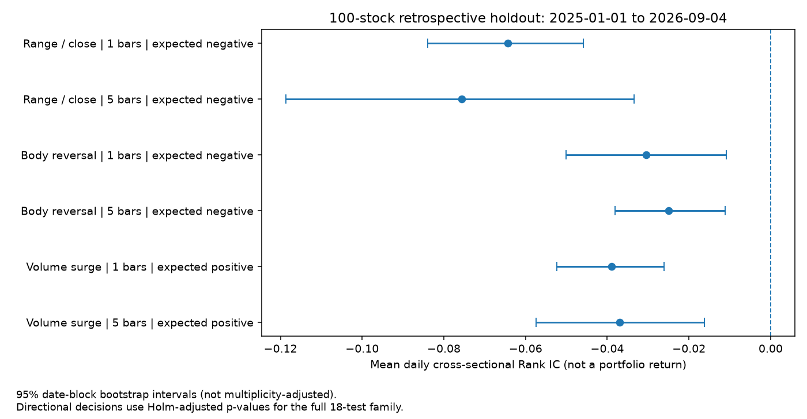

# 2026-09-17 自主因子后台实测

本次为用户明确授权的一次性、无可见客户端、最多三个候选的真实模型测试。

## 结论

**受限单批次的真实模型研究流程已通过；三个候选的有效性没有得到确认。**

模型自行调用数据摘要、查因子合同、提出并预览三个表达式，随后通过有效 Research Session Grant 提交三个真实研究，最后逐一读取真实 run 的结果。宿主另对三个归档复算，全部 numerically_matched。

本次仍由测试脚本负责阶段切换、授权、等待任务结束与最终撤销授权；并不是已经部署了每天自动唤醒模型的无人值守研究系统。没有修改既有 AR 自主计划或后台调度。

## 范围和角色

- 使用现有配置：Codex CLI 登录下的 GPT-5.5，medium；模型名单和响应均确认实际型号。
- 使用两只证券 `sh.600000`、`sz.000001` 的本地行情副本；研究区间固定 2024-01-01 至 2024-12-31，qfq、日线、research_only。
- 242 个不同交易时点，484 行输入。原始行情不发送给模型；测试专用只读摘要工具提供真实样本统计及 DSL 语法。
- 宿主只固定样本、预算、评价口径和 BASE.MOMENTUM 对照夹具，不提前指定三个候选公式。公式、名称、机制、预期方向和否证条件来自第一轮实际模型输出。
- 先冻结全部候选再计算，最多三个表达式；没有据结果修改方向或追加试验，没有正式注册因子。

## 模型实际提出的候选

| 候选 | 表达式 | 预登记 Rank IC 方向 | 有效因子值 | 复算 |
|---|---|---|---:|---|
| DSL_INTRADAY_RANGE_TO_CLOSE_V1 | `(high-low)/close` | 负向 | 484/484 | 数值匹配 |
| DSL_INTRADAY_BODY_REVERSAL_V1 | `(close-open)/open` | 负向 | 484/484 | 数值匹配 |
| DSL_VOLUME_SURGE_20D_V1 | `volume/rolling_mean(volume,20)` | 正向 | 446/484 | 数值匹配 |

三个表达式均通过规定样本上的白名单与前缀一致性检查；这不证明所有输入下的因果性，也未做全因子库语义去重，不能用新名字证明原创性或新 Alpha。

## 真实执行证据

| 阶段 | 结果 |
|---|---|
| 第一轮真实模型 | 8 次工具调用，读取数据/实际注册定义/基准，成功预览 3 个候选 |
| 第二轮真实模型 | 10 次工具调用，核对 Grant、预检并提交；包含一次队列活动任务上限拒绝和原配置重试 |
| 第三轮真实模型 | 3 次 get_experiment，逐一读候选结果并解释限制 |
| 任务 | 3 个独立 job，全部 completed；3 个逐任务 approval input freeze |
| 归档复算 | 3/3 numerically_matched，使用原有复算服务 |
| 授权收尾 | 测试 Grant 已撤销，used.jobs=3，无剩余额度 |
| 正式工作空间 | Research Session Grant 仍未配置，正式 DSL 注册数仍为 0 |
| 回归 | 新增 6 项后台接线测试通过；9 个相关模块合计 61 项通过，0 失败、0 跳过 |

第三次提交暂时遇到同时活动任务上限；模型读取前两个任务后，以未改变的配置重试。实际仍只有三个任务和三个预算槽，没有通过重试追加候选。

## 为什么不能说发现了有效因子

本轮使用的是前次已验证的两证券工程样本。`FactorResearchEngine` 明确要求每个时点至少 3 个有效证券才计算截面 IC/Rank IC；因此三个候选的 1 根和 5 根统计均为 `rank_ic=null`、`ic_dates=0`。

这不是“IC=0”，也不是“已经证明没有 Alpha”，而是该样本不具备检验预登记 Rank IC 假设的条件。模型正确保留了空值并说明限制，没有伪造 IC。

模型报告还列出了分位未来标签差异，但这属于描述性补充，不能替代事前规定的 Rank IC 检验。未进行代表性股票池、样本外、成本后账户收益、行业控制或前瞻验证；全部候选保持 UNVERIFIED，不晋级生产。

下一轮应先明确扩大样本及样本内/外设计，再冻结这些候选和评价指标，不能看了结果之后反转方向或增加参数试到显著。

## 发现并修正的验收脚本问题

真实模型三轮、三个研究和三次复算都已完成。最终检查脚本误将默认缩进输出的 JSON 对象流当作逐行 JSONL 解析，触发 JSONDecodeError。

保留原始对象流、初始失败结果和 traceback，修正日志写入为单行 JSONL；只离线重读原始事件并重新核对任务、冻结配置和复算记录，没有再次调用模型或重跑候选。最终 verification.json 记录 passed，同时保留 harness_initial_status=failed 和错误原因。

## 新增后台入口

`quantlab.agent.chat_cli` 新增 `--allow-granted-research`，仅在明确带 `--ask` 和 `--data-root` 的后台对话中接入惰性共享 JobQueue。

该开关不创建 Grant、不跳过范围/预算/时限/冻结输入检查；默认对话保持无执行队列。上下文退出时关闭本轮创建的队列，已经提交的合法研究等待完成后关闭。列表、探测、GUI 与该开关不可混用。

本次测试的三候选冻结和分阶段工具白名单是隔离验收脚本的额外约束，不应声称通用 CLI 已包含完整自主挖掘调度器。

## 证据位置

`artifacts/autonomous-factor-test-20260917-193940/`

| 文件 | 内容 |
|---|---|
| data-profile.json / input-files.json | 冻结样本统计、原文件及副本 SHA256 |
| 01-propose-response.json | 第一轮模型实际输出，含自拟公式、方向、机制与否证条件 |
| frozen-candidates.json | 计算前冻结的候选和精确研究配置 |
| model-events.jsonl | 规范化后的完整模型工具调用事件 |
| model-events.raw-json-sequence.txt | 未改写的原始对象流证据 |
| 02-execute-response.json / 03-review-response.json | 真实提交与复盘轮次输出 |
| model-review.md | 牛牛模型自己的结果解释 |
| workspace/ | 独立任务、输入冻结、报告和已撤销测试授权 |
| reproduced/ | 三个候选的独立归档复算 |
| verification.json / verification.log | 离线复核后的最终结论 |
| initial-harness-result.json / failure-traceback.txt | 保留的首轮验收脚本错误 |
| regression.log | 61 项相关回归日志 |

模型用量字段来自既有 Codex adapter 的 last tokenUsage，不代表整轮累计账单；本次未计算实际费用金额。

本轮没有 GUI、额外行情下载、正式因子注册、生产研究授权、订单或资金操作。四份原行情及测试副本 SHA256 保持一致。

## 第二阶段：100 股冻结候选的时间分割验证（2026-09-17）

**两个候选通过本轮预登记的回顾性信号门槛；放量候选的原正向假设未获支持。全部仍为 research_only、Alpha 未验证，不注册正式因子、不下单。**

本轮没有重新调用模型或生成新公式。沿用前一轮真实模型提出的三个 AST 与预登记方向，由确定性后台脚本扩大验证；没有反转放量因子方向，也没有择优替换股票或日期。

### 冻结样本与时段

股票池为沪市主板、深市主板、创业板、科创板各 25 只，共 100 只；从现有本地目录中按上市日期不晚于 2019-12-31 和固定 SHA256 种子排序选择，排除已用于原工程样本的两只银行股。没有依据收益、成交额或样本外覆盖择股；使用当前目录仍有样本选择/幸存者偏差，不能认证历史全集。2026-08-31 的行业快照仅用于事后描述组成（32 个分类），未参与历史中性化或选股。

| 时段 | 日期 | 用途 |
|---|---|---|
| 预热 | 2019-10-01 至 2019-12-31 | 只建立历史窗口，不纳入主检验 |
| 样本内 | 2020-01-01 至 2023-12-31 | 固定公式检查；970 个观测交易日 |
| 已见年份诊断 | 2024-01-01 至 2024-12-31 | 原模型生成阶段见过该年份，不当作样本外；242 日 |
| 历史样本外 | 2025-01-01 至 2026-09-04 | 回顾性留出检验；407 日，不是未来新数据或已证明模型未见数据 |

固定输入为 167,537 行。1/5 根未来标签的终点不得越过各阶段末日；因子预热保留历史，阶段末尾未成熟标签排除。样本外可计算 IC 的日数分别为 406 / 402。该口径是各证券的后续观测 K 线，不自动等价于可成交账户持有期。

### 数据质量阻塞与处理

标准 MQC 入口首先因空成交量/成交额拒绝加载：23 只证券合计 164 行，另有 51 行零成交量。没有换股、填零、填均值或改原始行情。先保留失败记录，再在任何候选计算之前追加冻结的研究专用数据质量约定：保留所有原始时点和空值，缺成交量/成交额或零成交量的信号时点不参与评价；20日量能因子的窗口内缺失继续自然传播。价格、时间、复权因子、负数数量、重复键等错误仍阻断。

该 nullable-volume 研究适配器独立于生产 MQC；**没有放宽原 validate_bars，也不能用于宣布正式行情完整或通过 Strict PIT**。初版 protocol 和追加前后哈希均保留。

### 检验合同与结果

主指标为日期等权的横截面 Rank IC，完整样本每时点至少 20 只有效证券；分板块描述至少 10 只。区间采用 20 日循环日期块 Bootstrap（1,999 次，单项 95% 区间），p 值采用既有 20 日块符号检验（最多 9,999 次；可枚举时采用精确模式）。三个候选 × 两个持有期 × 三个阶段共 **18 个检验槽**统一 Holm 校正，缺失项不删除。

冻结门槛要求：两个持有期都与原预登记方向一致，样本内方向一致，历史样本外有符号 Rank IC 至少 0.01，且两个样本外 Holm p 均不大于 0.05。年份/板块明细仅描述，不据此择优声称显著性。

| 候选 | 原方向 | 持有期 | 样本内 Rank IC | 历史样本外 Rank IC | 样本外 Holm p | 原方向判定 |
|---|---|---:|---:|---:|---:|---|
| 相对日内振幅 | 负 | 1 | -0.060340 | -0.064403 | 0.001800 | 符合 |
| 相对日内振幅 | 负 | 5 | -0.070924 | -0.075641 | 0.042725 | 符合 |
| 日内实体收益 | 负 | 1 | -0.032432 | -0.030474 | 0.035200 | 符合 |
| 日内实体收益 | 负 | 5 | -0.026114 | -0.025015 | 0.024000 | 符合 |
| 20日相对成交量 | 正 | 1 | -0.033958 | -0.039000 | 0.001800 | 不符合 |
| 20日相对成交量 | 正 | 5 | -0.022098 | -0.036927 | 0.042725 | 不符合 |

图中的区间是单项区间，不是同时置信带；方向判定采用表内全族 Holm p。负向候选的负 IC 与其原假设一致；放量候选虽然也是负 IC，但原假设为正，不能反向包装成“挖掘成功”。

振幅候选在四个板块的样本外描述均为负向。日内实体候选也具有负向观察，但深市主板1日很弱，且2024诊断年的两期限不显著；不应声称各年、各市场一致有效。全部 p 值依赖日期块符号对称等前提，跨块依赖可能影响有效性；未校正此前所有研究/模型训练带来的探索。

### 验收和边界

新增 10 项冻结候选测试，连同核心、Bootstrap、置换、时间分割、DSL、后台聊天共 7 模块 **47 项通过，0 失败、0 跳过**。三个候选的逐行因子值、观测、18组日度序列、统计及结论均独立重算匹配；100 份原始行情文件哈希保持一致。

捕获脚本初次把 protocol 的“内容校验值”误按“外层信封校验值”读取，在任何数据计算前被拒绝；已修正读取合同并增加正反向测试，原日志保留，协议、候选和检验方向未因此修改。

本轮不是收益回测，尚未检查扣费可执行组合收益、换手、滑点、逐日ST/停牌/涨跌停与实盘流动性；缺历史行业/市值中性化，也不是前瞻验证。通过者只具有继续做独立成交/成本/控制因子检验的资格，不能声称两个已确认 Alpha。没有新增模型调用、模型授权、后台常驻任务或正式注册。

### 本轮证据与复算入口

证据目录：`artifacts/frozen-candidate-validation-20260917-211359/`。

`protocol.initial.json` / `protocol.json` 保留初始协议与计算前的数据质量补充；`selected-universe.json` 保留选股清单；`snapshot.json` 与 `bars.parquet` 固定实际数据字节；`candidate-01/02/03` 保存完整因子、观测和分阶段日度序列；`result.json` 包含18项主检验、分年与分板块结果；`verification.json` 是重算回执。

源码入口：[冻结候选统计模块](../../../src/quantlab/experiments/frozen_candidate_validation.py)、[后台运行脚本](../../../scripts/validate_frozen_candidates.py)、[回归测试](../../../tests/test_frozen_candidate_validation.py)。脚本的 capture/run/verify 分开；run 拒绝覆盖已有运行，verify 只重算冻结结果、不增加研究或修改原数据。

本轮按用户新增要求收尾后普通推送当前 upstream（origin/main），不强推；远端 SHA 由 Git 推送回执核对。行情、artifacts 与凭据不提交。
